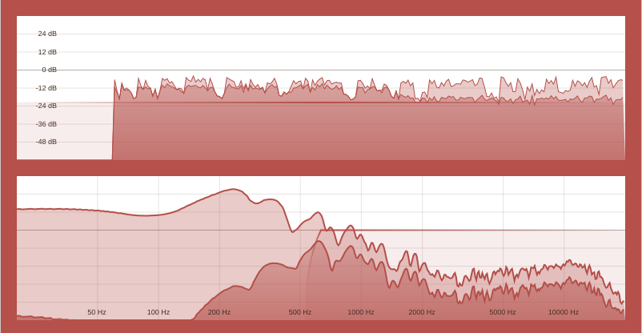

# Intellectual Gate



## Build from Source

1. **Clone the Repository:**
```bash
git clone https://codeberg.org/vivekvjyn/Intellectual-Gate.git
cd Intellectual-Gate
git submodule update --init --recursive
```
2. **Build the Plugin:**
```bash
cmake -B build -G Ninja -DCMAKE_BUILD_TYPE=Release
cmake --build build
```

## License
This project is licensed under the GNU General Public License. See the [LICENSE](https://codeberg.org/vivekvjyn/Intellectual-Gate/src/branch/main/LICENSE) for details.
